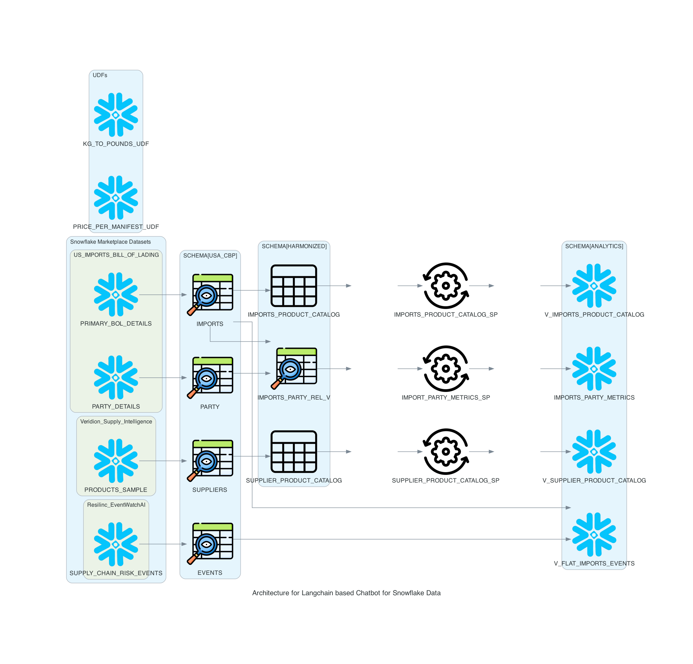

# Assignment4-USA-CBP-Import-Exports-Analysis
CICD enabled Snowflake based data pipelines for USA CBP imports and exports data. End user application that shows analytical dashboards on this supply chain dataset and AI enabled SQL query engine to do adhoc analysis


## Team Members 👥
- Aditya Kawale
  - NUID 002766716
  - Email kawale.a@northeastern.edu
- Nidhi Singh
  - NUID 002925684
  - Email singh.nidhi1@northeastern.edu
- Uddhav Zambare
  - NUID 002199488
  - Email zambare.u@northeastern.edu


## Links 📎
- Codelab Doc - [link](https://docs.google.com/document/d/1BUJotKMuDXXW1CqZrfk-Sli0t2utbHxiTiTFYFRhCYA/edit?usp=sharing)
- Demo Link - [link](https://drive.google.com/drive/folders/13U__JzwLv88_RbvuwXgVMKOtqvMm1Uss?usp=sharing)
- Streamlit - [link](https://streamlit.io/)
- GitRepo Links for Part A - Nidhi- [link](https://github.com/Nidhi18593/Assignment4-sfguide-data-engineering-with-snowpark-python)
                           - Aditya- [link](https://github.com/aditya26091999/sfguide-data-engineering-with-snowpark-python)
                           - Uddhav-  [link](https://github.com/uddhavz/sfguide-data-engineering-with-snowpark-python)

## Architecture 👷🏻‍♂️



## Steps to run this prroject locally:
Download SnowSQL CLI from this website
https://developers.snowflake.com/snowsql/

Pre-requisites:
1. Anaconda Installation
2. VS Code
3. Snowflake VS Code extension

Create a conda environment by running
```
conda env create -f environment.yml
```

Activate the conda environment
```
conda activate snowflake-demo
```

Point your VS Code workspace to use this newly created conda environment python interpreter

Update the config file at `~/.snowsql/config` by adding the following snippet
[connections.example] will be present already edit it, but add [connections.dev]

```
[connections.example]
accountname = <Your SF Account Name>
username = <Your SF Username>
password = <<Your SF Password>

[connections.dev]
accountname = <Your SF Account Name>
username = <Your SF Username>
password = <<Your SF Password>
rolename = ROLE_DAMG7245_TEAM7
warehousename = WH_DAMG7245_TEAM7
dbname = DB_DAMG7245_TEAM7
```

To test connectivity to snowflake using snowsql cli use the command in your terminal:
```
snowsql -c example
```

 If you have setup MFA for Snowflake, please complete the authorisation to successfully login to Snowflake using CLI

## Step 1
Run the `01_setup_snowflake.sql` to create warehouse, db and roles configured in `~/.snowsql/config` -> [connections.dev]

To test connectivity to newly created artifacts using snowsql cli use the command in your terminal:
```
snowsql -c dev
```

## Step 2
Use the below website to 'Get' the free dataset into your snowflake account
Note: While configuring the database into your snowflake keep the default settings like database name, schema name etc.

*Dataset 1: Trademo, US Imports Bill of Lading*

https://app.snowflake.com/marketplace/listing/GZT1ZVEJFJ/trademo-us-imports-bill-of-lading?search=imports

*Dataset 2: Resilinc, EventWatch AI*

https://app.snowflake.com/marketplace/listing/GZSTZO0V7VR/resilinc-eventwatch-ai?search=supply%20chain&pricing=free

*Dataset 3: Veridion, Supplier Intelligence: Product Catalogs*

https://app.snowflake.com/marketplace/listing/GZT1ZHESWT/veridion-formerly-soleadify-supplier-intelligence-product-catalogs-sample?available=installed

Run the script `02_setup_sfmarketplace_data.sql` to set the alias for these snowflake marketplace datasets

## Step 3
To create the views execute the `03_imports_party_rel_v.py` and `07_create_imports_events_view.py` script. Let's execute it from the terminal. So go back to the terminal in VS Code, make sure that conda environment is active, then run the following commands (which assume that your terminal has the root of your repository open):
```
cd steps
python 03_imports_party_rel_v.py
```
```
cd steps
python 07_create_imports_events_view.py
```

## Step 4
### Running the UDF Locally
To test the UDF locally, execute the `steps/04_price_per_manifest_udf/app.py` script. Like we did in the previous steps, we'll execute it from the terminal. So go back to the terminal in VS Code, make sure that your snowflake-demo conda environment is active, then run the following commands (which assume that your terminal has the root of your repository open):
```
cd steps/04_price_per_manifest_udf
python app.py 35
```

### Deploying the UDF to Snowflake
To deploy your UDF to Snowflake we will use the SnowCLI tool. The SnowCLI tool will do all the heavy lifting of packaging up your application, copying it to a Snowflake stage, and creating the object in Snowflake. Like we did in the previous steps, we'll execute it from the terminal. So go back to the terminal in VS Code, make sure that your conda environment is active, then run the following commands (which assume that your terminal has the root of your repository open):

```
cd steps/04_price_per_manifest_udf
snow function create
```

## Step 5
### Running the UDF Locally
To test the UDF locally, execute the `steps/05_kg_to_pounds_udf/app.py` script. Like we did in the previous steps, we'll execute it from the terminal. So go back to the terminal in VS Code, make sure that your snowflake-demo conda environment is active, then run the following commands (which assume that your terminal has the root of your repository open):
```
cd steps/05_kg_to_pounds_udf
python app.py 35
```

### Deploying the UDF to Snowflake
To deploy your UDF to Snowflake we will use the SnowCLI tool. The SnowCLI tool will do all the heavy lifting of packaging up your application, copying it to a Snowflake stage, and creating the object in Snowflake. Like we did in the previous steps, we'll execute it from the terminal. So go back to the terminal in VS Code, make sure that your conda environment is active, then run the following commands (which assume that your terminal has the root of your repository open):

```
cd steps/05_kg_to_pounds_udf
snow function create
```
## Step 6
### Running the Sproc Locally
To test the procedure locally, you will execute the `steps/06_IMPORT_PARTY_METRICS_sp/app.py` script. Like we did in the previous steps, we'll execute it from the terminal. So go back to the terminal in VS Code, make sure that your snowflake-demo conda environment is active, then run the following commands (which assume that your terminal has the root of your repository open):

```
cd steps/06_orders_update_sp
python app.py
```

### Deploying the Sproc to Snowflake
To deploy your sproc to Snowflake we will use the SnowCLI tool. Like we did in the previous steps, we'll execute it from the terminal. So go back to the terminal in VS Code, make sure that your snowflake-demo conda environment is active, then run the following commands (which assume that your terminal has the root of your repository open):

```
cd steps/06_IMPORT_PARTY_METRICS_sp
snow procedure create
```

## Step 7
### Running the Sproc Locally
To test the procedure locally, you will execute the `steps/08_populate_imports_product_catalog_view_sp/app.py` script. Like we did in the previous steps, we'll execute it from the terminal. So go back to the terminal in VS Code, make sure that your snowflake-demo conda environment is active, then run the following commands (which assume that your terminal has the root of your repository open):

```
cd steps/08_populate_imports_product_catalog_view_sp
python app.py
```

### Deploying the Sproc to Snowflake
To deploy your sproc to Snowflake we will use the SnowCLI tool. Like we did in the previous steps, we'll execute it from the terminal. So go back to the terminal in VS Code, make sure that your snowflake-demo conda environment is active, then run the following commands (which assume that your terminal has the root of your repository open):

```
cd steps/08_populate_imports_product_catalog_view_sp
snow procedure create
```

## Step 8
### Running the Sproc Locally
To test the procedure locally, you will execute the `steps/09_populate_supplier_product_catalog_view_sp/app.py` script. Like we did in the previous steps, we'll execute it from the terminal. So go back to the terminal in VS Code, make sure that your snowflake-demo conda environment is active, then run the following commands (which assume that your terminal has the root of your repository open):

```
cd steps/09_populate_supplier_product_catalog_view_sp
python app.py
```

### Deploying the Sproc to Snowflake
To deploy your sproc to Snowflake we will use the SnowCLI tool. Like we did in the previous steps, we'll execute it from the terminal. So go back to the terminal in VS Code, make sure that your snowflake-demo conda environment is active, then run the following commands (which assume that your terminal has the root of your repository open):

```
cd steps/09_populate_supplier_product_catalog_view_sp
snow procedure create
```

## Contribution 🤝
*   Aditya : 34`%` 
*   Nidhi : 33`%`
*   Uddhav : 33`%`

## Individual Distribution ⚖️

| **Developer** |          **Deliverables**          	            |
|:-------------:|:-------------------------------------------------:|
|      Aditya   | Data loading to snowflake for pipeline            |
|      Aditya   | Creating views and UDFs for One of the datasets   |
|      Aditya   | CICD code and testing                             |
|      Uddhav   | Architecture Diagram                              |
|      Uddhav   | Creating views and UDFs for One of the datasets   |
|      Nidhi    | Streamlit and Langchain code                      |
|      Nidhi    | Data Research and Documentation                   |

---
---
> WE ATTEST THAT WE HAVEN’T USED ANY OTHER STUDENTS’ WORK IN OUR ASSIGNMENT AND ABIDE BY THE POLICIES LISTED IN THE STUDENT HANDBOOK.
